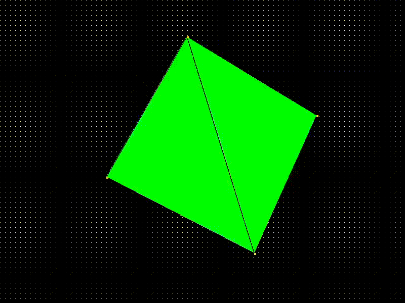

# 3D Renderer from Scratch in C with SDL2

This project is a custom-built 3D renderer written in C, using SDL2 for the GUI interface and developed from scratch. It utilizes a left-handed coordinate system and is designed with a focus on understanding 3D graphics fundamentals. This project follows along with the **Pikuma** course, while implementing my own coding style and ideas, as the course encourages.

## Features
- **SDL2 Initialization**: Sets up SDL2 for handling graphics output and allocates necessary memory.
- **Projection and Drawing**:
  - Projects 3D points onto a 2D plane for rendering.
  - Draws lines, rectangles, and triangles to construct 3D objects on the screen.
- **OBJ File Loading**: Imports `.obj` 3D model files to render complex geometries.
    - Note that random colors are selected per face, texture implementation will be done later on.
- **Back-Face Culling**: Uses a basic back-face culling algorithm to optimize rendering by skipping faces that are not visible to the camera.
- **Triangle Rasterization**: rasterization to accurately fill in triangles for solid object rendering.
- **Z Buffer** *ongoing - currently using a basic painter algorithm*
- **4x4 matrix**: Dropped the original backend system to implement a more suited matrix one.

## Keyboards inputs (WIP)
- Pressing “1” displays the wireframe and a small red dot for each triangle vertex
- Pressing “2” displays only the wireframe lines
- Pressing “3” displays filled triangles with a solid color
- Pressing “4” displays both filled triangles and wireframe lines
- Pressing “c” we should enable back-face culling
- Pressing “d” we should disable the back-face culling
This might be changed later on for better features.

## Getting Started

### Prerequisites
- Install [SDL2](https://www.libsdl.org/download-2.0.php) on your system.

### Building the Project
1. Clone the repository:
   ```bash
   git clone https://github.com/your-username/3d-renderer.git
   ```
2. Navigate to the project directory and build
    ```bash
    cd 3dRenderer
    make
    ```
3. To run the executable:
    ```bash
    make run
    ```
4. To clean the build files
    ```bash
    make clean
    ```

## Loading OBJ Files
To import other `.obj` files, call the loadObj function in the `src/main.c` file. Please ensure the model uses triangles as faces for compatibility.

## Running the renderer
After building, run the executable:
    ```bash
        ./renderer
    ```

## Acknowledgments
- **Pikuma's course**:  This project was inspired by and developed following the Pikuma course on 3D graphics, adapted to my own coding style and approaches as encouraged by the course materials.
- **SLD**: A lightweight, cross-platform library for handling media and graphics, which powers the GUI in this project.
---

